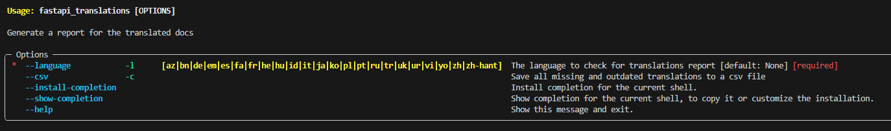
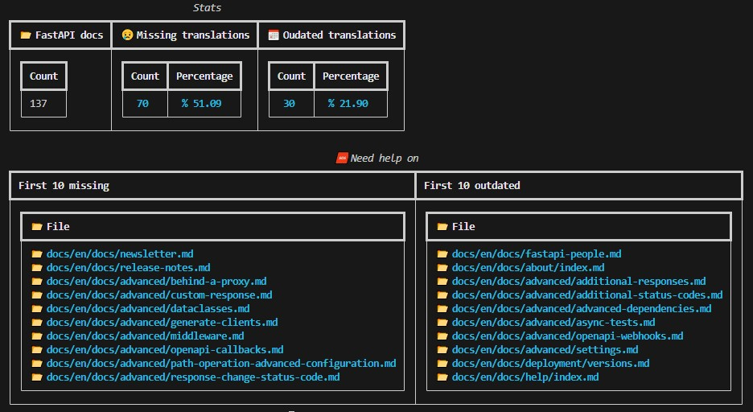

# FastAPI Translations Management

Easy management for translations of the [FastAPI](https://github.com/fastapi/fastapi) project documentation.

✨ Inspired by the this [pull request](https://github.com/fastapi/fastapi/pull/11864) from [@lucasbalieiro](https://github.com/lucasbalieiro).

## 🙋🏾‍♀️ Who's this library for?

This is a very specific package, intended for contributors of [FastAPI](https://github.com/fastapi/fastapi) translations.

If you don't work with us, feel free to look around, but I don't think you'll be able to use it anywhere else

## Instalation

## 💽 Installation

Install using `pip install -U fastapi-translations`.

## ⌨️ Usage

After installing fastapi-translations, you'll be able to use it anywhere via the `fastapi_translations` command.

You can see all options with `fastapi_translations --help`:

A basic usage is: `fastapi_translations -l pt -c`.

It will scan all english docs in FastAPI project, check which documents have translations into the language informed, and which documents, despite having a translation, are out of date.

You'll need to wait a little bit while it is analyzing all docs:

And when it is done, you'll see a brief summary:

And a `csv` file will be saved: `fastapi-translations-lang-{chosen-language}.csv` with all files, dates, etc. 🤗
